# KeyGuard: A Modern UI for Secure RFID-based Key Management

A **user interface (UI)** for the KeyGuard project, developed in Svelte with a Neobrutalism design aesthetic. This style was chosen for its stark, functional aesthetic that emphasizes clarity and direct user interaction, which is crucial for a security-focused application.

A companion project to [key-guard](https://github.com/aryan-programmer/key-guard): an automatic key management and locking system utilizing RFID tags for enhanced security.

## Key Features

KeyGuard provides a robust solution for managing physical keys securely. Its key features include:

- **RFID-based Key Management:** Automatic identification and secure latching of keys into designated slots.
- **Robust User Authentication:** Secure user access through username/password or RFID user ID cards.
- **Customizable Access Control:** User-specific permissions dictate which keys can be accessed (e.g., User 2 can only access Key to Lab Alpha).
- **Intuitive Web-based UI:** A modern interface for real-time monitoring and control of key slots.
- **Real-time Event Logging & Auditing:** Comprehensive logging of all system events for full audit trails, enhancing security and accountability.
- **Malicious Activity Detection:** Notifies users on the UI if any suspicious activity is detected.

## System Architecture

### Hardware Components

The current prototype runs on a Raspberry Pi system and includes:

- **Two key slots,** each featuring:
  - One solenoid to latch the key into the slot.
  - One RFID reader to identify the key placed in the slot.
- **One RFID reader** for the user authentication module.
- All RFID readers are connected to the system via a shared SPI bus.
- **Key Identification Module:** Currently supports two distinct keys:
  - Key 1: Key to Lab Alpha
  - Key 2: Key to Device Beta
- **User Authentication Module Database:** Currently contains two authorized users:
  - User 1: Authorized to access both Key to Lab Alpha and Key to Device Beta.
  - User 2: Authorized to access only Key to Lab Alpha.
- Any unrecognized keys or user ID cards are rejected by the system.
- The Python WebSocket server is implemented using the `websockets` PyPI package.

### Software Stack

The project leverages modern web technologies and a Python backend:

- The web UI is developed using Svelte 5 and the SvelteKit framework. Svelte was chosen for its reactivity and compiled-away framework, leading to small bundle sizes, crucial for performance and responsiveness.
- The codebase is written in TypeScript to provide static typing during compilation/bundling, enhancing code quality and maintainability.
- Component styling is implemented using Tailwind CSS in conjunction with Svelte’s scoped CSS styles (with PostCSS as a preprocessor), allowing for efficient and modular styling.
- The UI uses WebSockets to communicate with the RPi server.
  - The `websocket-as-promised` library wraps the native JavaScript WebSocket API, enabling fluent asynchronous operations using Promises and `async`/`await` syntax, which simplifies complex async workflows.
- The Python WebSocket server is implemented using the `websockets` PyPI package, ensuring reliable real-time communication between the UI and the Raspberry Pi.

## Images

### Hardware prototype images

#### Implemented Circuit Wiring Diagram

#### Front view (Visible to end users)

Front view with key inserted and user ID card reader location shown:

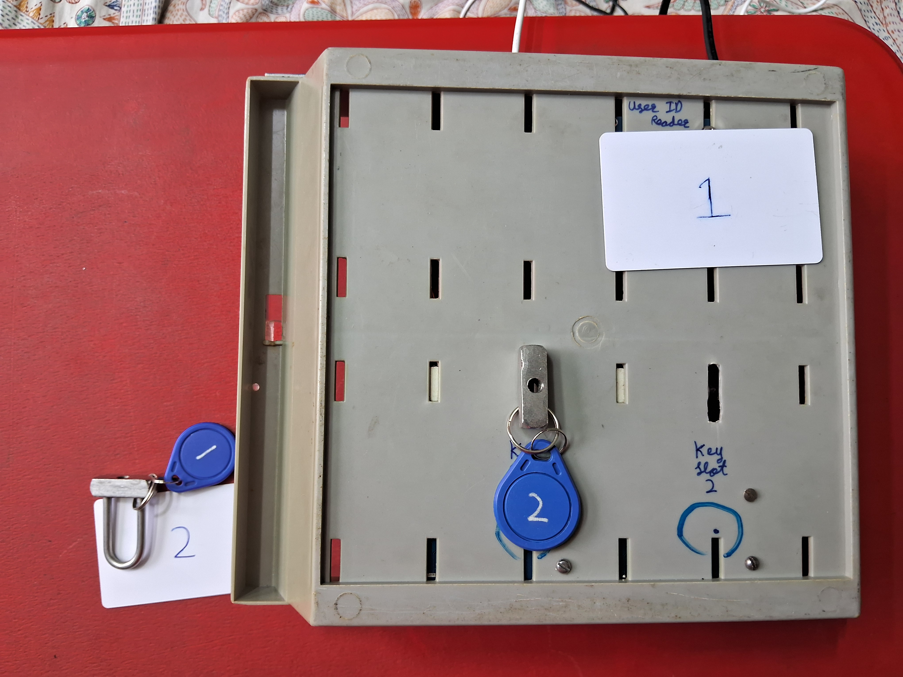

#### Internal view

### Web UI Screenshots (User Workflow)

The following screenshots demonstrate the typical user workflow through the KeyGuard web interface, highlighting key interaction points and system responses.

Instructions:

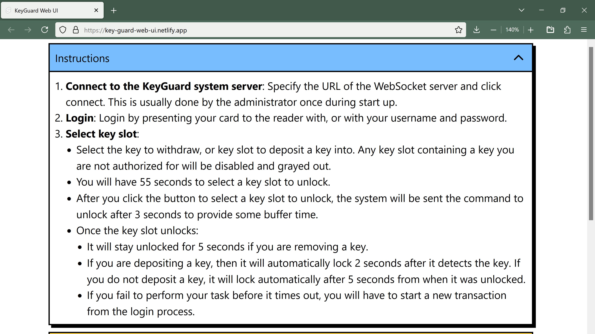

WebSocket Connection stage:

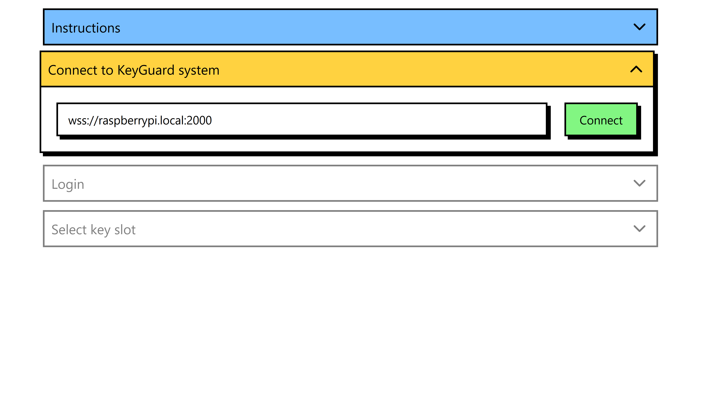

Login Page:

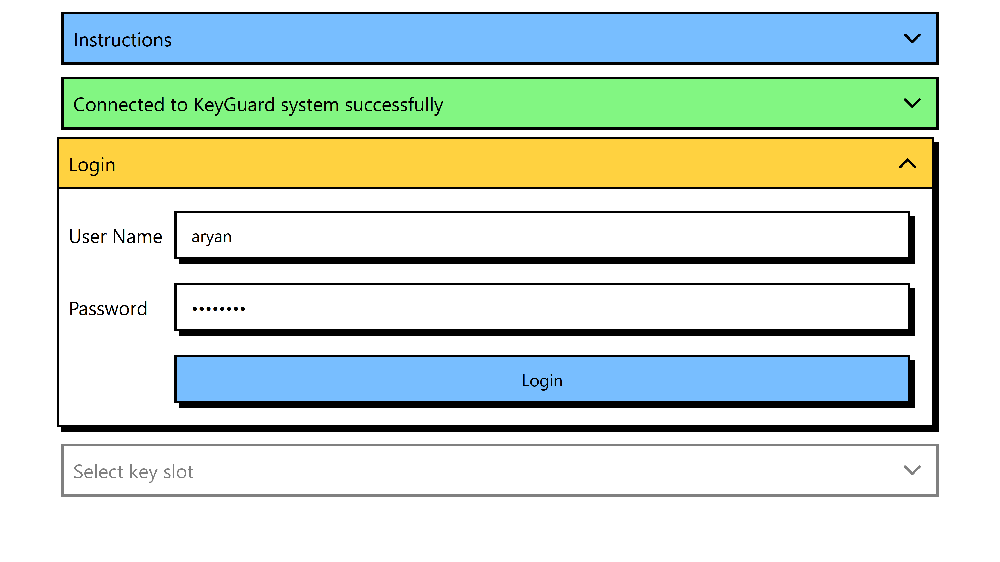

After logging in (via username/password or User 1's ID card), the user is presented with the option to select a Key Slot to unlock. A selection must be made within 60 seconds, or the user will be automatically logged out. (Note: Unlocking is also possible by presenting a key card to the RFID reader, as demonstrated in the Hardware prototype images.)

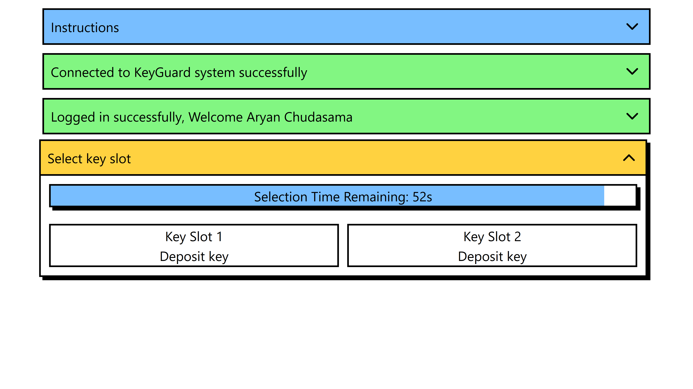

Upon selecting Key Slot 1 for key deposit, the user has 3 seconds to prepare.

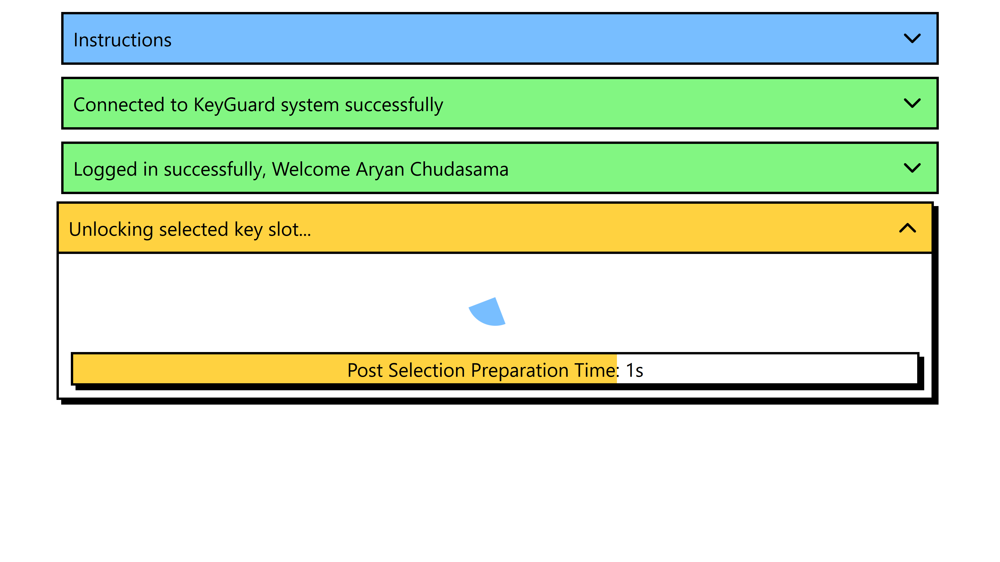

The key slot then unlocks, providing 5 seconds to deposit the key (or withdraw it, as will be shown later).

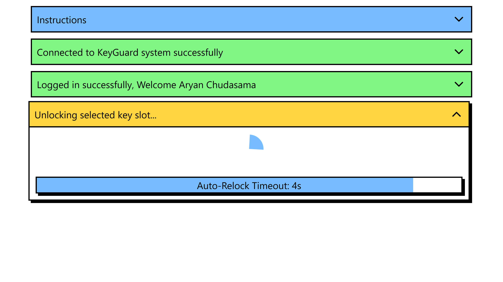

After depositing the key, the transaction completes, and a notification is displayed.

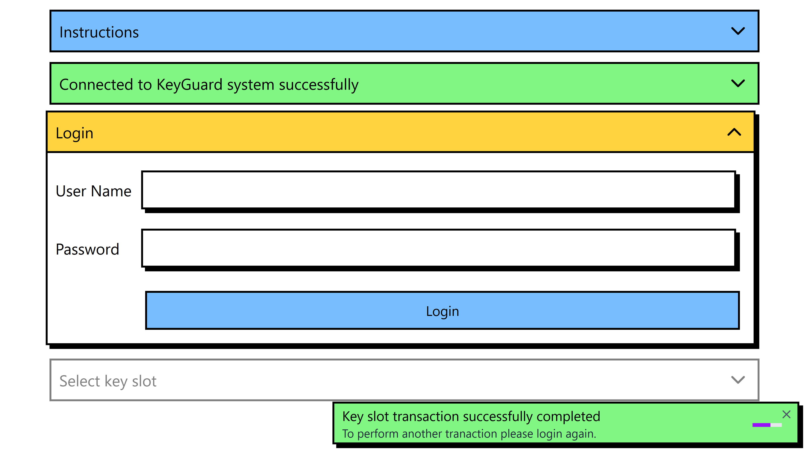

After logging in again, the option to withdraw keys becomes available. For now, we will demonstrate depositing the second key.

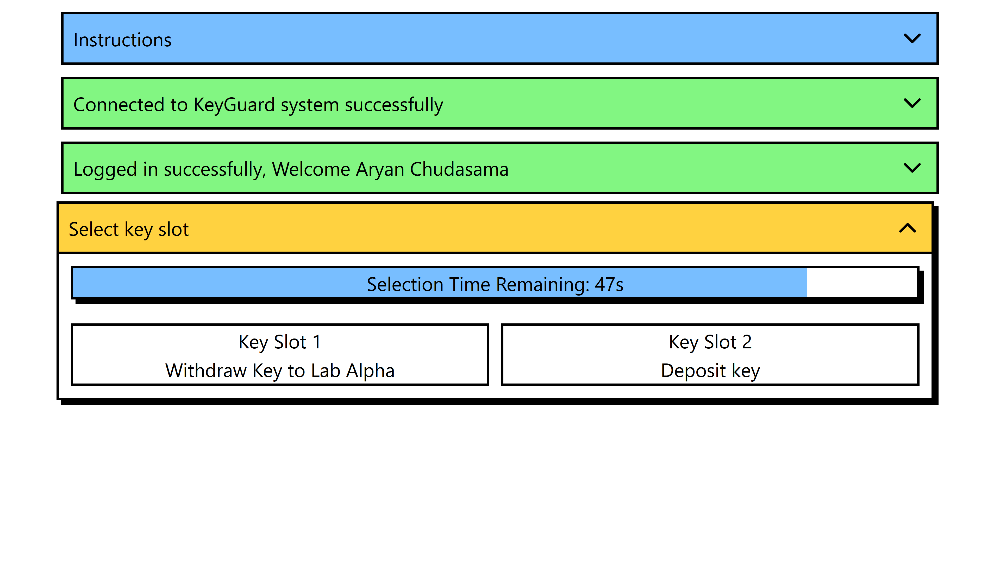

After logging in again, User 1 is presented with the option to withdraw either key:

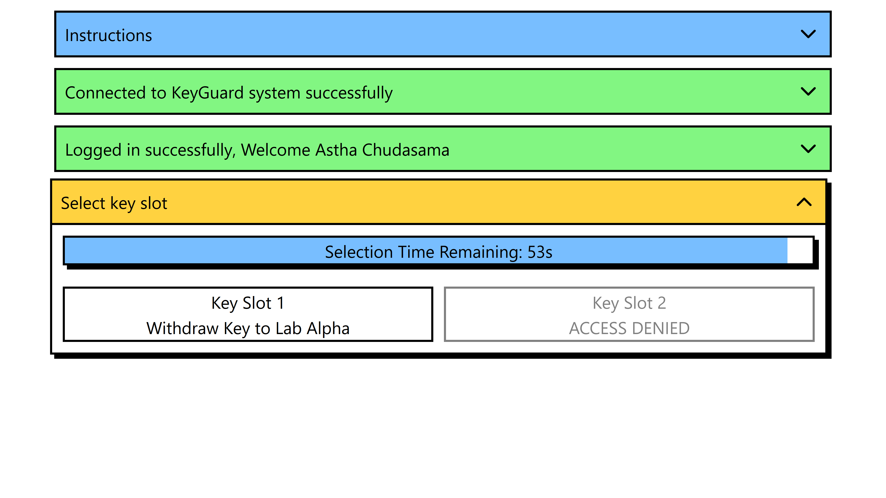

However, User 2 is forbidden from accessing the Key to Device Beta:

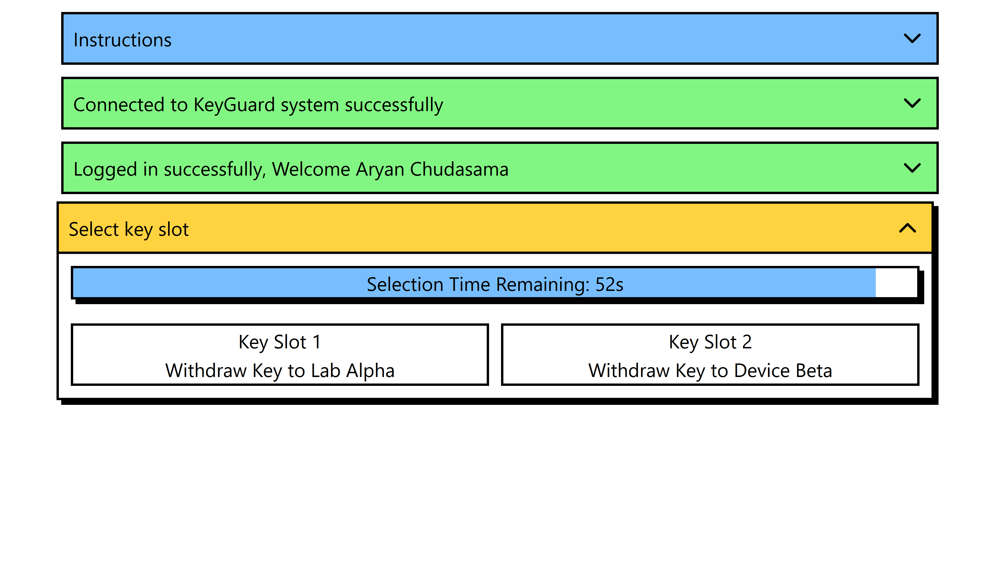

To withdraw any key, simply click the corresponding button and follow a process similar to the key deposit procedure.

Additionally, any detected malicious activity will trigger a notification on the UI.

Furthermore, the RPi application logs all events for comprehensive auditing.
